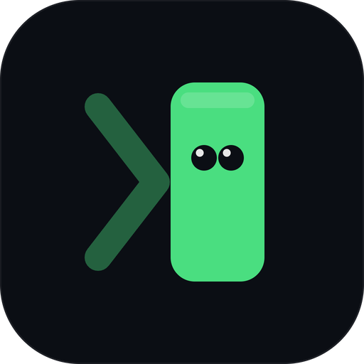

# NovusTerm

### A modern terminal *workspace* for macOS — not just a terminal.

Tabs · split & floating panes · embedded browser · file explorer · SSH · AI —
in one fast, beautiful, deeply customizable window.

 

### [⬇&nbsp; Download for macOS](https://github.com/NovusTerm/novus-term-releases/releases/latest)

&nbsp;
&nbsp;
&nbsp;-555)

---

> ⚠️ **Early beta (v0.1.0).** NovusTerm works today — the whole workspace below is
> real — but it's under active development, so expect some rough edges. Your
> feedback shapes what ships next.

## What is NovusTerm?

Most terminals make you choose: *fast and minimal* **or** *feature-rich but heavy
and locked-down*. **NovusTerm refuses the trade-off.** It's a first-class command
line **plus** a real, GPU-era workspace you fully control — tabs, split panes, an
embedded web browser, a file explorer, remote sessions, and an AI assistant, all in
**one** window.

It's built on a battle-tested terminal engine, so the effort goes into the
*experience* — the panes, the customization, the polish — not into re-solving
decades-old terminal problems.

## Who it's for

Developers who live in the terminal and want it to be a **workspace**, not a lonely
prompt: people juggling several projects, remote servers, logs, docs, and a browser
tab at once — and who care about how their tools **look and feel**.

## Highlights

Everything here is in the app. Items marked **Pro** need a subscription — see
[Pricing](#pricing) below.

- 🗂️ **Tabs, split panes, saved workspaces** — arrange your work and come back to it
  exactly as you left it. _Floating panes and synchronized input are **Pro**._
- 🌐 **Embedded web browser _with devtools_** — read docs or debug a page without
  leaving the terminal.
- 📁 **File explorer with previews** — images, markdown, code, PDF and CSV right
  beside your shell. _Video, audio and Excel/Word/PowerPoint previews, folder
  search and bookmarks are **Pro**._
- ⌘ **Command blocks & palette** — group each command's input/output, jump around
  with ⌘K, and type faster with autocompletion. _Searching past command output (the
  time machine) is **Pro**._
- 🔐 **SSH remote sessions** — saved connections with your own keys. NovusTerm never
  stores or handles your credentials. _Jump / bastion hosts are **Pro**._
- 🤖 **AI assistant** — a streaming chat pane that reads your terminal, with your own
  API key. _Per-command "explain / fix" actions and the agent console are **Pro**._
- 📊 **System & process monitor** — CPU, memory and a live process list. _Terminating
  processes, per-process details and disk/network I/O are **Pro**._
- 🎨 **55 themes, 13 fonts, per-pane transparency** — all free, all yours.
- 🔄 **Auto-updating** — secure, signature-verified updates, in-app.

## Pricing

**Free forever**, with a **7-day Pro trial** on first launch. No account — a license
key is your access.

The Free plan is a real terminal, not a demo: **6 terminal tabs** (4 panes each),
**3 workspaces**, **every theme and font**, the browser, the file explorer, SSH, and
AI chat with your own API key.

| Plan | Price | Macs |
|---|---|---|
| **Free** | $0 forever | — |
| **Pro Monthly** | $6.99 / month | 1 |
| **Pro Quarterly** | $17.99 / quarter (−14%) | 1 |
| **Pro Annual** | $49 / year (−42%) | **2** |

Every Pro plan unlocks the **same** features — they differ only in price and how many
Macs they cover. Compare them in the app under **Account ▸ Compare plans**.

> **Billing opens soon.** Until then, Pro is available through the 7-day trial.

## Download & install

1. Grab **`NovusTerm_<version>_universal.dmg`** from the
   **[latest release](https://github.com/NovusTerm/novus-term-releases/releases/latest)**.
2. Open the `.dmg` and drag **NovusTerm** into your **Applications** folder.
3. Launch it. Because the build is **signed with an Apple Developer ID and notarized
   by Apple**, it opens without the "unidentified developer" warning.

**Requirements:** macOS **11 (Big Sur) or later**, Apple Silicon **or** Intel (one
universal build runs natively on both).

## Auto-update

NovusTerm updates itself: it checks this repo's release feed, and any update it
installs is **cryptographically verified** (Ed25519) before it's applied — so you
always get an authentic, untampered build.

## What's in each release

Every release has clear notes — **what's new, what changed, what's fixed** — and the
full running history lives in **[`CHANGELOG.md`](./CHANGELOG.md)**.

## Links

| | |
|---|---|
| ⬇️ Download | **[Latest release](https://github.com/NovusTerm/novus-term-releases/releases/latest)** · [all releases](https://github.com/NovusTerm/novus-term-releases/releases) |
| 📝 Changes | [CHANGELOG](./CHANGELOG.md) |
| 🔧 How releases are published | [docs/RELEASE-PROCESS.md](./docs/RELEASE-PROCESS.md) |
| 📄 License / EULA | [English](./LICENSE.md) · [Español](./LICENSE.es.md) |
| 🔒 Privacy | [English](./PRIVACY.md) · [Español](./PRIVACY.es.md) |
| 📦 Open-source notices | [THIRD_PARTY_NOTICES.md](./THIRD_PARTY_NOTICES.md) |

---

**NovusTerm** · © 2026 NovusTerm. All rights reserved.
Proprietary software — see the [license](./LICENSE.md). This repo distributes
official signed builds only; it contains no source code.

