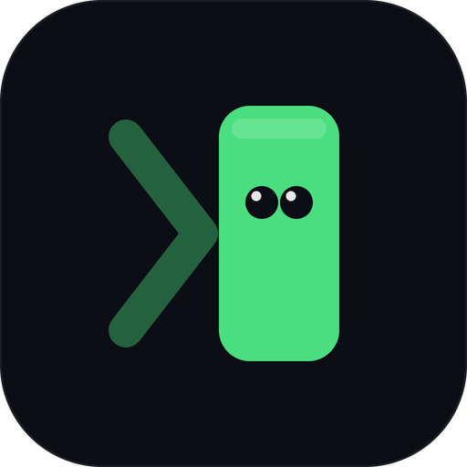

# NovusTerm

### A modern terminal *workspace* for macOS — not just a terminal.

Tabs · split & floating panes · embedded browser · file explorer · SSH ·
source control · API client · voice · AI — in one fast, beautiful, deeply
customizable window.

 

### [⬇&nbsp; Download for macOS](https://github.com/NovusTerm/novus-term-releases/releases/latest)

&nbsp;
&nbsp;
&nbsp;-555)

---

> ⚠️ **Beta.** NovusTerm works today — the whole workspace below is real — but it's
> under active development, so expect some rough edges. Your feedback shapes what
> ships next.

## What is NovusTerm?

Most terminals make you choose: *fast and minimal* **or** *feature-rich but heavy
and locked-down*. **NovusTerm refuses the trade-off.** It's a first-class command
line **plus** a real, GPU-era workspace you fully control — tabs, split panes, an
embedded web browser, a file explorer, remote sessions, source control, an API
client, voice dictation and an AI assistant, all in **one** window.

It's built on a battle-tested terminal engine, so the effort goes into the
*experience* — the panes, the customization, the polish — not into re-solving
decades-old terminal problems.

## Who it's for

Developers who live in the terminal and want it to be a **workspace**, not a lonely
prompt: people juggling several projects, remote servers, logs, docs, and a browser
tab at once — and who care about how their tools **look and feel**.

## Highlights

Everything here is in the app. Items marked **Pro** need a subscription — see
[Pricing](#pricing) below.

- 🗂️ **Tabs, split panes, floating panes, saved workspaces** — arrange your work and
  come back to it exactly as you left it. _Synchronized input across panes is
  **Pro**._
- 🌐 **Embedded web browser _with devtools_** — read docs or debug a page without
  leaving the terminal.
- 📁 **File explorer with previews and search** — images, markdown, code, PDF and CSV
  right beside your shell. _Rich Office, notebook and archive previews, file version
  history and bookmarks are **Pro**._
- ⌘ **Command blocks & palette** — group each command's input/output, jump around
  with ⌘K, and type faster with autocompletion. Each panel remembers its own command
  history. _Searching past command output (the time machine) is **Pro**._
- 🔐 **SSH remote sessions** — saved connections with your own keys. NovusTerm never
  stores or handles your credentials. _Jump / bastion hosts are **Pro**._
- 🌿 **Source control** — stage, commit, branch and merge beside the shell that
  built the change. _The git timeline in the diff viewer is **Pro**._
- 🔌 **API client** — collections, environments, OAuth and multi-request flows,
  without leaving the window. _Running one script across a whole folder or
  collection is **Pro**._
- 🎙️ **Voice dictation** — on-device Apple Speech in four places, with an optional
  bilingual engine for mixed Spanish/English. **Dictated text is inserted, never
  run**, and nothing leaves your Mac unless you ask for that optional engine.
- 🤝 **Claude Code connector** — your coding agent reports *working*, *needs you* and
  *finished* straight into the pane, the tab strip and the tree.
- 🤖 **AI assistant** — a streaming chat pane that reads your terminal, with your own
  API key. _Per-command "explain / fix" actions and the agent console are **Pro**._
- 📊 **System & process monitor** — CPU, memory and a live process list. _Terminating
  processes, per-process details and disk/network I/O are **Pro**._
- 🎨 **92 themes, 31 fonts, per-pane transparency and zoom** — all free, all yours.
- 🔄 **Auto-updating** — secure, signature-verified updates, in-app.

## Pricing

**There is a free plan**, and a **21-day Pro trial** on first launch. No account — a
license key is your access.

The Free plan is a real terminal, not a demo: **20 terminal tabs**, unlimited panes
inside them, **3 workspaces**, **every theme and font**, the browser, the file
explorer with search, floating panes, SSH, source control, the API client, voice
dictation, the Claude Code connector, and AI chat with your own API key.

What Pro adds is **memory**: Free keeps the last **30 days** of your history — SSH
log, API exchanges, the command time machine, file versions — and Pro keeps all of
it, along with the features marked **Pro** above.

| Plan | Price | Macs |
|---|---|---|
| **Free** | $0 | — |
| **Pro Monthly** | $9.99 / month | **2** |
| **Pro Quarterly** | $26.99 / quarter (−10%) | **2** |
| **Pro Annual** | $95 / year (−21%) | **2** |

Every Pro plan unlocks the **same** features — they differ only in price. **All three
cover two Macs**, and extra Macs can be added to any of them. Compare the plans in
the app under **Account ▸ Compare plans**.

> **Billing opens soon.** Until then, Pro is available through the 21-day trial.

## Download & install

1. Grab **`NovusTerm_<version>_universal.dmg`** from the
   **[latest release](https://github.com/NovusTerm/novus-term-releases/releases/latest)**.
2. Open the `.dmg` and drag **NovusTerm** into your **Applications** folder.
3. Launch it. Because the build is **signed with an Apple Developer ID and notarized
   by Apple**, it opens without the "unidentified developer" warning.

**Requirements:** macOS **14 (Sonoma) or later**, Apple Silicon **or** Intel (one
universal build runs natively on both).

## Auto-update

NovusTerm updates itself: it checks this repo's release feed, and any update it
installs is **cryptographically verified** (Ed25519) before it's applied — so you
always get an authentic, untampered build.

## What's in each release

Every release has clear notes — **what's new, what changed, what's fixed** — and the
full running history lives in **[`CHANGELOG.md`](./CHANGELOG.md)**.

## Links

| | |
|---|---|
| ⬇️ Download | **[Latest release](https://github.com/NovusTerm/novus-term-releases/releases/latest)** · [all releases](https://github.com/NovusTerm/novus-term-releases/releases) |
| 📝 Changes | [CHANGELOG](./CHANGELOG.md) |
| 🔧 How releases are published | [docs/RELEASE-PROCESS.md](./docs/RELEASE-PROCESS.md) |
| 🔢 Where the numbers above come from | [docs/README-FACTS.md](./docs/README-FACTS.md) |
| 📄 License | [LICENSE.md](./LICENSE.md) |

---

**NovusTerm** · © 2026 NovusTerm. All rights reserved.
Proprietary software — see the [license](./LICENSE.md). This repo distributes
official signed builds only; it contains no source code.

